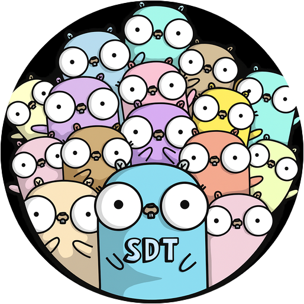

    
    <h2 align="center">Willkommen 👋 zu <code>software-development-training</code> (SDT)</h2>

---

[Einleitung](#einleitung) | [Agenda](#agenda) | [Tooling](#tooling) | [Playground](#playground) | [Ressourcen](#ressourcen) | [License](#license)

## Einleitung

### 🥇 Was

Dieses Repository dient der Azubi-Ausbildung für den Lehrplansteilbereich Software-Entwicklung.

### 🥈 Wozu

- Um ein Basisverständnis zur Software-Entwicklung zu schaffen.
- Um Anwendungsgebiete an Hand von praxisnahen Beispielen kennen zu lernen.

### 🥉 Wer

- Die Zielgruppe sind die Azubis der **BIG direkt gesund** sowie der **Proact**.
- Die Durchführung der Schulung erfolgt durch die **BIG**.

 

## Agenda

> [!NOTE]
> 👨‍🏫 Tutor(en) für das Themengebiet 
> (👨‍🚒) Vertretender Tutor für das Themengebiet

| Rubrik                               | Inhalt                                                                     | Datum/Zeit               | Patryk | Sven  | Sebastian | Sascha | Neo   | Maurice |
| ---                                  | ---                                                                        | :---:                    | :---:  | :---: | :---:     | :---:  | :---: | :---:   |
| 👋&nbsp;Kick-off                     | Kennenlernen, Agenda vorstellen                                            | 12.01.2026 ~ **0,5h** | (👨‍🚒)  | 👨‍🏫    |           | 👨‍🏫     |       |         |
| 🧱&nbsp;[Grundlagen]                 |                                                                            | 12.01.2026 ~ **6h**   |        | 👨‍🏫   |           | 👨‍🏫     |       | (👨‍🚒)   |
|                                      | Gängige Programmiersprachen & relevante Anwendungsbereiche                 |                          |        |       |           |        |       |         |
|                                      | Variablen/Datentypen, Operatoren, Bedingungen, Schleifen, I/O, Algorithmen |                          |        |       |           |        |       |         |
|                                      | Backend vs. Frontend (und wie sie zusammenspielen)                         |                          |        |       |           |        |       |         |
|                                      | Datenbanken                                                                |                          |        |       |           |        |       |         |
| 🌿&nbsp;[Versionsverwaltung]         | [Git]                                                                      | 15.01.2026 ~ **4h**   |        | 👨‍🏫   | (👨‍🚒)      |        |       | (👨‍🚒)   |
| 🔗&nbsp;[Softwareökosystem]          |                                                                            | 16.01.2026 ~ **8h**   |        | 👨‍🏫   | (👨‍🚒)      |        |       | (👨‍🚒)   |
|                                      | GitHub/GitLab als Plattformen                                              |                          |        |       |           |        |       |         |
|                                      | Framework-Dokumentationen und Referenzen                                   |                          |        |       |           |        |       |         |
|                                      | Lizenzen (Open Source != Free)                                             |                          |        |       |           |        |       |         |
|                                      | Laufzeitumgebungen (Node.js, .NET CLR, JVM)                                |                          |        |       |           |        |       |         |
|                                      | APIs/Schnittstellen                                                        |                          |        |       |           |        |       |         |
|                                      | Einsatz von KI (als Unterstützung, kein vibe coding)                       |                          |        |       |           |        |       |         |
| 🌐&nbsp;[Sprachen & Anwendungsfälle] |                                                                            | ~ **13h**                 |        |       |           |        |       |         |
|                                      | Powershell- und Shell-Scripting (Automatisierung)                          | 22.01.2026 ~ **7h**   |        |       |           | (👨‍🚒)   | 👨‍🏫    |         |
|                                      | C# ("C Sharp")                                                             | 23.01.2026 ~ **6h**   |        |       | (👨‍🚒)      | 👨‍🏫     |       | (👨‍🚒)   |
|                                      |                                                                            | -------- ~ **32h**    |        |       |           |        |        |         |

 

## Tooling

> [!IMPORTANT]
> Die folgende Software, Zugänge und Konfigurationen sind erforderlich für die Umsetzung der Schulung (fluent training flow).

- GitHub Account
- [Git](https://git-scm.com/install/windows)
- [Visual Studio Community Edition](https://visualstudio.microsoft.com/de/vs/community/)
- [VSCode](https://code.visualstudio.com/Download) (Visual Studio Code)
  - Extensions (wird bei Bedarf eingerichtet)
  - Settings (wird per Download zu Verfügung gestellt)
  - Terminal bash und Powershell (wird während der Schulung eingerichtet)

 

## Playground

> [!TIP]
> Im Verzeichnis [Playground] können die Azubis ihre Versuche, Tests und Übungen machen/hinterlegen.

 

## Ressourcen

- https://github.com/ByteByteGoHq/system-design-101
- ...

 

## License

Veröffentlicht unter der MIT-Lizenz. Siehe [LICENSE](./LICENSE.md) für weitere Informationen.

##

[To the top](#top)

[Grundlagen]:                 ./docs/basics/basics.md
[Versionsverwaltung]:         ./docs/version-control/version-control.md
  [Git]:                      ./docs/version-control/git.md
[Softwareökosystem]:          ./docs/software-ecosystem/software-ecosystem.md
[Sprachen & Anwendungsfälle]: ./docs/languages-use-cases/languages-use-cases.md
[Playground]:                 ./src/playground/
